# House Price Prediction Using Stacked Ensemble Regression
Stacked ensemble linear regression, combining XGBoost and CatBoost with Lasso and Ridge, to enhance house price predictions.

# Setup

## Dependencies

This project requires the following Python libraries:

- pandas
- numpy
- scikit-learn
- matplotlib
- seaborn
- scipy
- scikit-optimize
- xgboost
- catboost
- joblib

## Installation

To install the required dependencies for this project, follow these steps:

1. **Clone the Repository**:

	First, clone the repository to your local machine using the following command:

	```bash
	git clone https://github.com/StavrosChatzipavlidis/stacked-ensemble-regression.git
	```
   
2. **Navigate to the Project Directory**:

	Use the cd command to change your current directory to the cloned repository:

	```bash
	cd your-repository
	```

3. **Install Dependencies**:

	Once you're in the project directory, install the required dependencies using the pip command and the requirements.txt file:

	```bash
	pip install -r requirements.txt
	```

By following these steps, you will set up the project environment with all the required dependencies.

## Importing Libraries

To import the necessary libraries, simply execute the following command:

```python
from imports import *
```
	
# Project Overview: Predicting House Prices

**Description**:

In this project, we aim to predict house prices using a stacked ensemble regression approach. The dataset contains various features such as the number of bedrooms, bathrooms, square footage of living space, and more. By leveraging machine learning techniques, we aim to build a predictive model that can accurately estimate house prices based on these features.

**Data Overview**:

Below is an overview of the dataset containing information on house prices and related features:

| Price     | Bedrooms | Bathrooms | Sqft Living | Sqft Lot | Floors | Waterfront | View | Condition | Sqft Above | Sqft Basement | Yr Built | Yr Renovated |
|-----------|----------|-----------|-------------|----------|--------|------------|------|-----------|------------|---------------|----------|--------------|
| 313000.0  | 3.0      | 1.50      | 1340        | 7912     | 1.5    | 0          | 0    | 3         | 1340       | 0             | 1955     | 2005         |
| 2384000.0 | 5.0      | 2.50      | 3650        | 9050     | 2.0    | 0          | 4    | 5         | 3370       | 280           | 1921     | 0            |
| 342000.0  | 3.0      | 2.00      | 1930        | 11947    | 1.0    | 0          | 0    | 4         | 1930       | 0             | 1966     | 0            |
| 420000.0  | 3.0      | 2.25      | 2000        | 8030     | 1.0    | 0          | 0    | 4         | 1000       | 1000          | 1963     | 0            |
| 550000.0  | 4.0      | 2.50      | 1940        | 10500    | 1.0    | 0          | 0    | 4         | 1140       | 800           | 1976     | 1992         |


# Data Preprocessing

## Handling Missing Values

```python
df.isna().sum()
```

### Absence of Missing Values

The absence of missing values is advantageous as it eliminates the need for methods like multiple imputation or mean filling, which could potentially introduce additional variance to the data.

### Creating New Feature: Total Square Footage

```python
df['total_sqft'] = df['sqft_living'] + df['sqft_above'] + df['sqft_basement']
```

Although sqft_lot exists, it represents the entire area of the land and not just the house. Therefore, we create a new feature, total_sqft, which represents the total square footage of the house. We will test its correlation with the target variable afterwards, as larger houses usually tend to be more expensive.

# Target Variable Analysis

## Checking for Instances with Negative or Zero Prices

<details>

```python
instances_with_negative_or_zero_price = df[(df['price'] <= 0)]

if not instances_with_negative_or_zero_price.empty:
    print("There are instances with negative or zero prices:")
    print(instances_with_negative_or_zero_price)
else:
    print("There are no instances with negative or zero prices.")
```

</details>

There are instances with negative or zero prices:
|     | price | bedrooms | bathrooms | sqft_living | sqft_lot | floors | waterfront | view | condition | sqft_above | sqft_basement | yr_built | yr_renovated |
|-----|-------|----------|-----------|-------------|----------|--------|------------|------|-----------|------------|---------------|----------|--------------|
| 4354 | 0.0   | 3.0      | 1.75      | 1490        | 10125    | 1.0    | 0          | 0    | 4         | 1490       | 0             | 1962     | 0            |
| 4356 | 0.0   | 4.0      | 2.75      | 2600        | 5390     | 1.0    | 0          | 0    | 4         | 1300       | 1300          | 1960     | 2001         |
| 4357 | 0.0   | 6.0      | 2.75      | 3200        | 9200     | 1.0    | 0          | 2    | 4         | 1600       | 1600          | 1953     | 1983         |
| 4358 | 0.0   | 5.0      | 3.50      | 3480        | 36615    | 2.0    | 0          | 0    | 4         | 2490       | 990           | 1983     | 0            |
| 4361 | 0.0   | 5.0      | 1.50      | 1500        | 7112     | 1.0    | 0          | 0    | 5         | 760        | 740           | 1920     | 0            |

</details>

There are instances with prices set to zero. These instances are not realistic and should be removed from the dataset.

## Removing Instances with Zero Prices

```python
indices_to_drop = df[df['price'] == 0].index
df.drop(indices_to_drop, inplace=True)
```


## Checking for Outliers in Price

<details>

```python
plt.figure(figsize=(8, 6))
sns.boxplot(data=df['price'], orient='v', palette='Set2')
plt.title('Box Plot for Price')
plt.ylabel('Price')
plt.show()
```

</details>

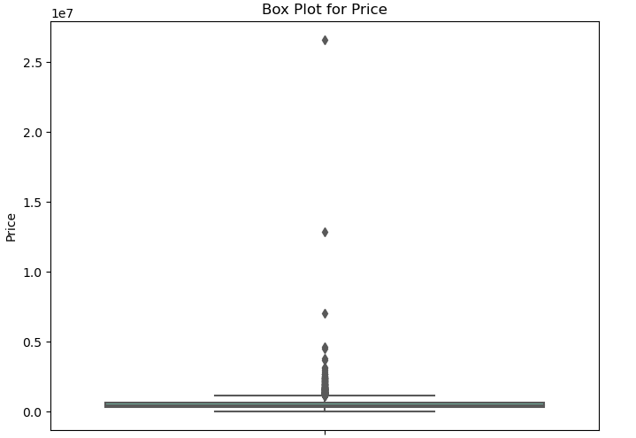

## Visualizing Price vs. Total Square Feet

<details>

```python
plt.scatter(x=df['total_sqft'], y=df['price'])
plt.ylabel('Price')
plt.xlabel('Total Square Feet')
plt.show()
```

</details>

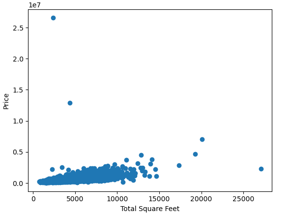

Here, there are 3 outliers that don't make sense: two very expensive houses with very little square footage and a house with a lot of total square footage but a very low price. Let's investigate them.

## Handling Outliers

### Instances with Unusual Prices

<details>

```python
# Get the rows with the 2 highest values in the 'price' column
top_2_highest = df.nlargest(2, 'price')

print("Instances with the highest price:")
print(top_2_highest)
```

</details>

Top 2 highest values in the 'Price' column:
| Instance | Price      | Bedrooms | Bathrooms | Sqft Living | Sqft Lot | Floors | Waterfront | View | Condition | Sqft Above | Sqft Basement | Year Built | Year Renovated | Total Sqft |
|----------|------------|----------|-----------|--------------|-----------|---------|-------------|------|------------|--------------|-----------------|-------------|-----------------|--------------|
| 4350     | 26,590,000 | 3        | 2.0       | 1,180        | 7,793     | 1.0     | 0           | 0    | 4          | 1,180        | 0               | 1992        | 0               | 2,360        |
| 4346     | 12,899,000 | 3        | 2.5       | 2,190        | 11,394    | 1.0     | 0           | 0    | 3          | 1,550        | 640             | 1956        | 2001            | 4,380        |

<details>

```python
description = df[['total_sqft', 'sqft_lot']].describe().reset_index()

# Rename the 'index' column to 'Statistics'
description.rename(columns={'index': 'Statistics'}, inplace=True)

# Print the descriptions
print(description.to_string(index=False))
```

</details>

Descriptive statistics of total_sqft and sqft_lot:
|   Statistics |   total_sqft |   sqft_lot |
|--------------|--------------|------------|
| count        |      4551.000|    4551.000|
| mean         |      4264.744|   14835.281|
| std          |      1911.899|   35964.078|
| min          |       740.000|     638.000|
| 25%          |      2920.000|    5000.000|
| 50%          |      3940.000|    7680.000|
| 75%          |      5220.000|   10978.000|
| max          |     27080.000| 1074218.000|

The analysis reveals that the first instance lacks justification for its price, as its total square footage falls below the 25th percentile, and its 'sqft_lot' measurement is marginally below the 50th percentile. Similarly, while the second instance exhibits total square footage within the 25-50th percentile range, and its 'sqft_lot' slightly surpasses the 75th percentile, the property's price remains unjustifiable. This is evident from the existence of cheaper houses with larger 'sqft_lot' measurements, indicating that the size of the plot alone cannot account for the higher price. Consequently, both instances are identified as outliers.

### Removing Outliers with Highest Prices

To ensure the integrity of our analysis, we identified outliers characterized by exceptionally high prices. Instances where the price exceeded $12,000,000 and the total square footage was less than 5000 square feet were flagged as outliers. Subsequently, these outliers were removed from the dataset to mitigate their potential influence on our modeling efforts. The following Python code snippet demonstrates this outlier removal process:

<details>

```python
instances_with_highest_price = df[(df['price'] > 12e6) & (df['total_sqft'] < 5000)].index

df.drop(instances_with_highest_price, inplace=True)
```

</details>

## Instances with Unusually High Square Footage

<details>

```python
top_2_highest_sqft = df.nlargest(2, 'total_sqft')

print("Instances with the highest Total_sqft:")
print(top_2_highest_sqft)
```

</details>

| Instance |    price   |  bedrooms |  bathrooms | sqft_living | sqft_lot | floors | waterfront | view | condition | sqft_above | sqft_basement | yr_built | yr_renovated | total_sqft |
|----------|------------|-----------|------------|-------------|----------|--------|------------|------|-----------|------------|----------------|----------|--------------|------------|
|   122    | 2,280,000  |   7.000   |    8.000   |    13,540   |  307,752 |  3.000 |      0     |  4   |     3     |    9,410   |      4,130     |   1999   |      0       |    27,080  |
|   2286   | 7,062,500  |   5.000   |    4.500   |    10,040   |   37,325 |  2.000 |      1     |  2   |     3     |    7,680   |      2,360     |   1940   |    2001      |    20,080  |


Despite being the largest house in terms of total square footage, the price of the first instance appears relatively low when compared to properties of similar sizes. When assessing its rank in the price range, the code below demonstrates that it occupies the 30th position:

<details>

```python
# Sort the DataFrame by price in descending order
sorted_df = df.sort_values(by='price', ascending=False)

# Find the index of instance 122
index_of_instance_122 = sorted_df.index.get_loc(122)

# Rank of instance 122 based on price (add 1 as indexing starts from 0)
rank_of_instance_122 = index_of_instance_122 + 1

print(rank_of_instance_122)
```

</details>

Given the large size of the first instance relative to its comparatively low price, it's advisable to remove this entry from the dataset.

## Instances with Unusually Low Price

In this code snippet, we filter out instances with prices less than $1,000,000 and then sort the DataFrame by price in ascending order. This step ensures that outliers or anomalies in the data, such as extremely low prices, are appropriately addressed before proceeding with further analysis.

<details>

```python
# Instances with a price less than 1 million
filtered_df = df[df['price'] < 1e6]

sorted_df = filtered_df.sort_values(by='price', ascending=True)

sorted_df.head()
```

</details>

Instances with a price less than 1 million:
| price | bedrooms | bathrooms | sqft_living | sqft_lot | floors | waterfront | view | condition | sqft_above | sqft_basement | yr_built | yr_renovated | total_sqft |
|-------|----------|-----------|-------------|----------|--------|------------|------|-----------|------------|---------------|----------|--------------|------------|
| 7800  | 2        | 1.00      | 780         | 16344    | 1.0    | 0          | 0    | 1         | 780        | 0             | 1942     | 0            | 1560       |
| 80000 | 1        | 0.75      | 430         | 5050     | 1.0    | 0          | 0    | 2         | 430        | 0             | 1912     | 0            | 860        |
| 83000 | 2        | 1.00      | 900         | 8580     | 1.0    | 0          | 0    | 3         | 900        | 0             | 1918     | 0            | 1800       |
| 83300 | 3        | 2.00      | 1490        | 7770     | 1.0    | 0          | 0    | 4         | 1490       | 0             | 1990     | 0            | 2980       |
| 83300 | 3        | 2.00      | 1370        | 78408    | 1.0    | 0          | 0    | 5         | 1370       | 0             | 1964     | 0            | 2740       |

As you can see there is a house with a price of 7800, we can also safely delete that instance.


## Let's Revisit the Dataset

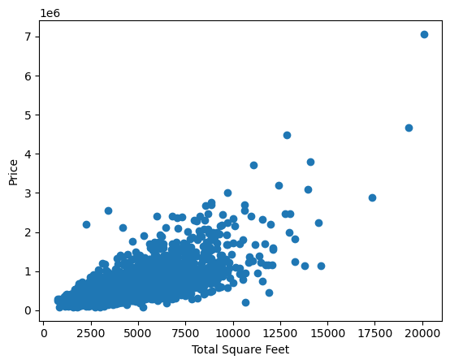

Now, the scatterplot reveals a clearer pattern, with price increasing as total square footage increases, suggesting a more linear relationship between the two variables.

# Exploratory Data Analysis (EDA)

## Analyzing Price Distribution with Histogram and QQ-Plot

<details>
```python
sns.distplot(df['price'] , fit=norm);

# Get the fitted parameters used by the function
(mu, sigma) = norm.fit(df['price'])
print( '\n mu = {:.2f} and sigma = {:.2f}\n'.format(mu, sigma))

#Now plot the distribution
plt.legend(['Normal dist. ($\mu=$ {:.2f} and $\sigma=$ {:.2f} )'.format(mu, sigma)],
            loc='best')
plt.ylabel('Frequency')
plt.title('Price distribution')

#Get also the QQ-plot
fig = plt.figure()
res = stats.probplot(df['price'], plot=plt)
plt.show()
```
</details>

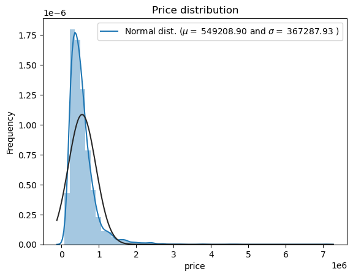

Calculating the skewness and kurtosis we get:
Skewness: 3.998881
Kurtosis: 36.681189

A positive skewness value (3.998881) indicates a significant right skew, meaning that there is a long tail of high values on the right side of the distribution.

A high positive kurtosis value (36.681189) suggests heavy tails and an unusually sharp peak, indicating that extreme values are more likely to occur than in a normal distribution.

The target variable exhibits right skewness. Linear models tend to perform better with data that follows a normal distribution. Therefore, we need to transform this variable to achieve a more normal distribution.

## Evaluating Price Transformations for Normality

We will compare two methods—Log Transformation and Box-Cox Transformation—to convert the variable into a more normal distribution.

<details>
```python
transformation_methods = {
    'Original': lambda x: x,
    'Log Transformation': np.log1p,
    'Box-Cox Transformation': lambda x: boxcox(x)[0],
}

for name, transform in transformation_methods.items():
    plt.figure(figsize=(10, 4))
    
    transformed_data = transform(df['price'])
    
    plt.subplot(1, 2, 1)

    sns.distplot(transformed_data, fit=norm);
    mu, sigma = norm.fit(transformed_data)
    plt.legend(['Normal dist. ($\mu=$ {:.2f} and $\sigma=$ {:.2f} )'.format(mu, sigma)],
            loc='best')
    plt.ylabel('Frequency')
    plt.title('{} distribution'.format(name))
    
    plt.subplot(1, 2, 2)
    probplot(transformed_data, plot=plt) # QQ plot
    plt.title('{} QQ Plot'.format(name))
    
    plt.tight_layout()
    plt.show()
```
</details>

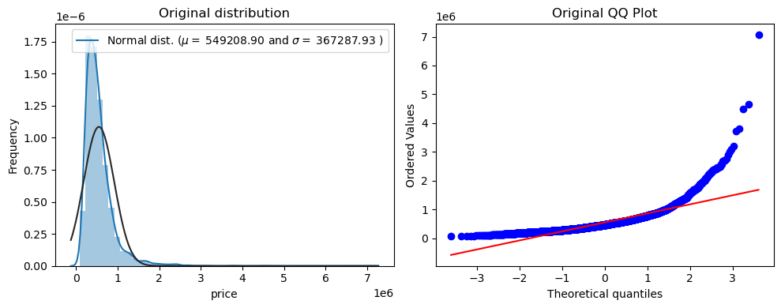
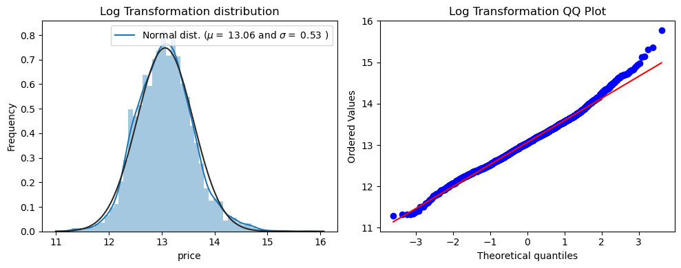
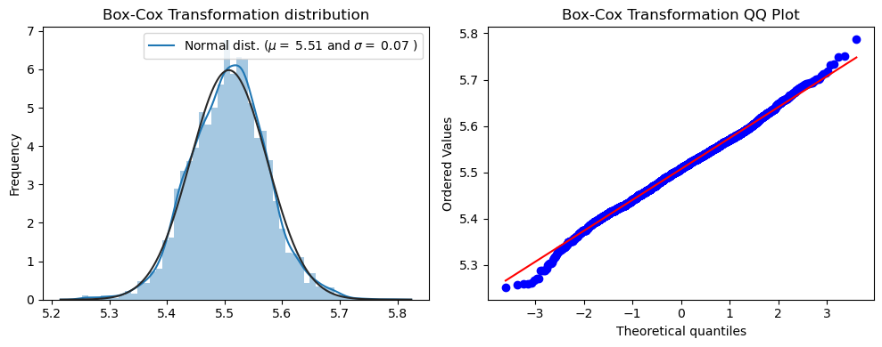

### Comparison of Log and Box-Cox Transformations

This code applies Log and Box-Cox transformations to the price variable, then calculates and prints the skewness, kurtosis, and Shapiro-Wilk test p-value for each transformed dataset to evaluate their normality.

<details>
```python
# log1p transformation
log_transformed_data = np.log1p(df['price'])

# Box-Cox transformation
boxcox_transformed_data, _ = boxcox(df['price'] + 0.01)

print("Log Transformation:")
print("Skewness:", skew(log_transformed_data))
print("Kurtosis:", kurtosis(log_transformed_data))
shapiro_log = shapiro(log_transformed_data)
print("Shapiro-Wilk test p-value:", shapiro_log[1])

print("\nBox-Cox Transformation:")
print("Skewness:", skew(boxcox_transformed_data))
print("Kurtosis:", kurtosis(boxcox_transformed_data))
shapiro_boxcox = shapiro(boxcox_transformed_data)
print("Shapiro-Wilk test p-value:", shapiro_boxcox[1])
```
</details>

| Transformation         | Skewness       | Kurtosis       | Shapiro-Wilk p-value         |
|------------------------|----------------|----------------|------------------------------|
| Log Transformation      | 0.3007         | 0.6221         | 5.81e-14                     |
| Box-Cox Transformation  | -0.0116        | 0.4169         | 1.98e-06                     |

Both transformations have effectively reduced skewness and achieved distributions with moderate tail heaviness. However, neither transformation fully normalizes the data, as indicated by the low p-values from the Shapiro-Wilk tests.

The Box-Cox transformation produces data with skewness and kurtosis closer to 0, indicating a more symmetrical distribution and tails resembling a normal distribution, supported by the Shapiro-Wilk test showing stronger evidence of normality compared to the Log transformation.

## Analyzing Price Trends Across Various Features

This code generates bar plots to visualize the relationship between house prices and several features, including bedrooms, waterfront, view, condition, yr_built, and yr_renovated, using median price for each category.

<details>
```python
num_bins = 5

# Generate equally spaced bins
bins = np.linspace(1900, 2014, num_bins + 1)

columns = ['bedrooms', 'waterfront', 'view', 'condition', 'yr_built', 'yr_renovated']

fig, axes = plt.subplots(3, 2, figsize=(10, 8))

axes = axes.flatten()

year_categories = {
    'yr_built': pd.cut(df['yr_built'], bins=bins, labels=[f'{int(bins[i])}-{int(bins[i+1])}' for i in range(len(bins)-1)]),
    'yr_renovated': pd.cut(df['yr_renovated'], bins=bins, labels=[f'{int(bins[i])}-{int(bins[i+1])}' for i in range(len(bins)-1)])
}

for i, column in enumerate(columns):
    if column in ['yr_built', 'yr_renovated']:
        sns.barplot(x=year_categories[column], y='price', data=df, estimator=np.median, ax=axes[i], palette='Set2')
        axes[i].set_title(f'Price vs {column.capitalize()}')
        axes[i].set_xlabel(f'{column.capitalize()} Category')
    else:
        sns.barplot(x=column, y='price', data=df, estimator=np.median, ax=axes[i], palette='Set2')
        axes[i].set_title(f'Price vs {column.capitalize()}')
        axes[i].set_xlabel(column.capitalize())
    axes[i].set_ylabel('Price')

plt.tight_layout()
plt.show()
```
</details>

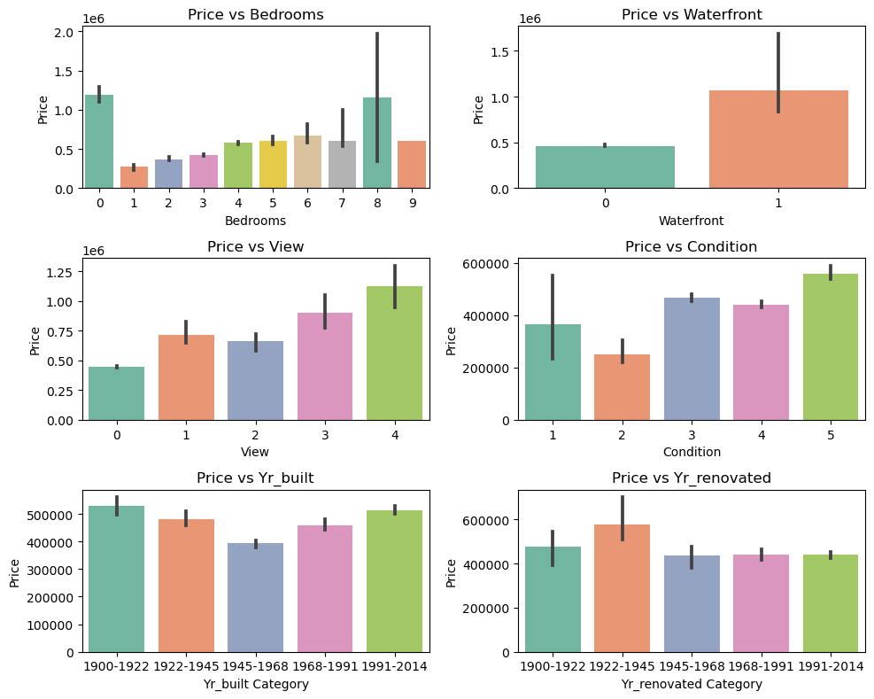

The analysis reveals that prices generally increase with the number of bedrooms, though anomalies exist with zero-bedroom homes commanding high prices and nine-bedroom houses priced lower. Features like waterfront access, views, and condition show an upward trend in pricing. Notably, the most expensive homes were built between 1900-1922 and 1991-2014, likely due to larger sizes or advanced features. Renovation years appear less impactful, except for homes renovated between 1922-1945, which show a notable price increase.

## Correlation of Numerical variables

This section generates a heatmap to visualize the correlation matrix of numerical variables in the dataset, highlighting relationships between features.

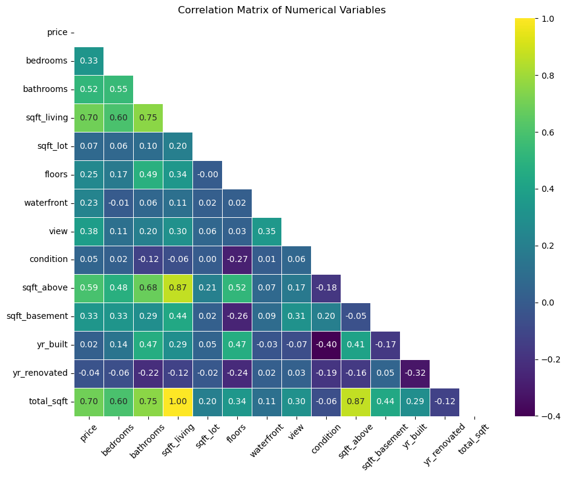

The correlation analysis highlights low correlations among most features, with a notable exception found between "total_sqft" and "sqft_living," indicating multicollinearity, allowing us to drop sqft_living. The target variable, "price," exhibits a significant correlation (0.7) with "total_sqft," reflecting the common trend of higher prices associated with increased square footage. Features such as "sqft_above," "bathrooms," "bedrooms," and "sqft_basement" also show correlations with price, reinforcing their influence on housing prices. Furthermore, features like "view," "floors," and "waterfront" demonstrate moderate correlations with price, suggesting their relevance in determining property values.

## Data Transformation with Box-Cox

This section applies the Box-Cox transformation to the sqft_lot, sqft_above, and total_sqft variables, visualizing the effects through density plots of both the original and transformed distributions. It also features QQ plots for each variable to assess normality by comparing sample quantiles against theoretical quantiles, demonstrating how closely the transformed data approximates a normal distribution.

<details>
```python
# Box-Cox transformation on 'sqft_lot'
transformed_sqft_lot, lambda_value = boxcox(df['sqft_lot'])

fig, axes = plt.subplots(2, 2, figsize=(12, 10))

# Plot the original distribution of 'sqft_lot'
sns.distplot(df['sqft_lot'], fit=norm, ax=axes[0, 0])
axes[0, 0].set_title('Original Distribution of sqft_lot')
axes[0, 0].set_xlabel('sqft_lot')
axes[0, 0].set_ylabel('Density')

# Plot the Box-Cox transformed distribution of 'sqft_lot'
sns.distplot(transformed_sqft_lot, fit=norm, ax=axes[0, 1])
axes[0, 1].set_title('Box-Cox Transformed Distribution of sqft_lot')
axes[0, 1].set_xlabel('Transformed sqft_lot')
axes[0, 1].set_ylabel('Density')

# QQ plot for original 'sqft_lot'
res = stats.probplot(df['sqft_lot'], plot=axes[1, 0])
axes[1, 0].set_title('QQ Plot: Original sqft_lot')
axes[1, 0].set_xlabel('Theoretical Quantiles')
axes[1, 0].set_ylabel('Sample Quantiles')

# QQ plot for Box-Cox transformed 'sqft_lot'
res = stats.probplot(transformed_sqft_lot, plot=axes[1, 1])
axes[1, 1].set_title('QQ Plot: Box-Cox Transformed sqft_lot')
axes[1, 1].set_xlabel('Theoretical Quantiles')
axes[1, 1].set_ylabel('Sample Quantiles')

plt.tight_layout()
plt.show()
```
</details>

**sqft_lot**
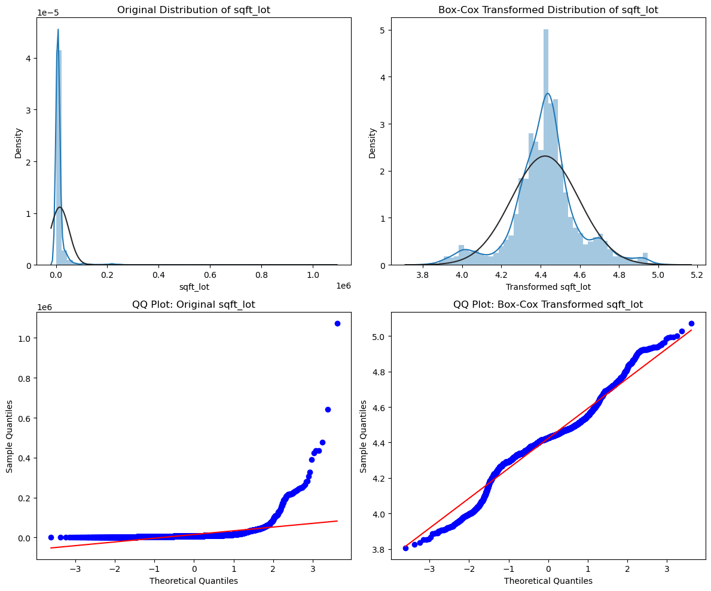

**sqft_above**
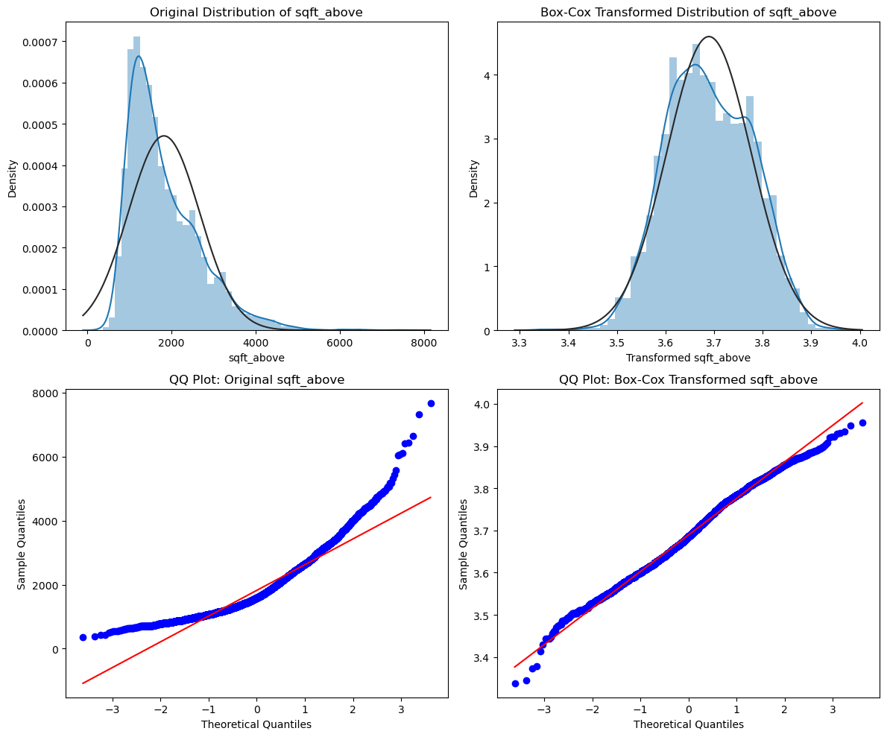

**total_sqft**
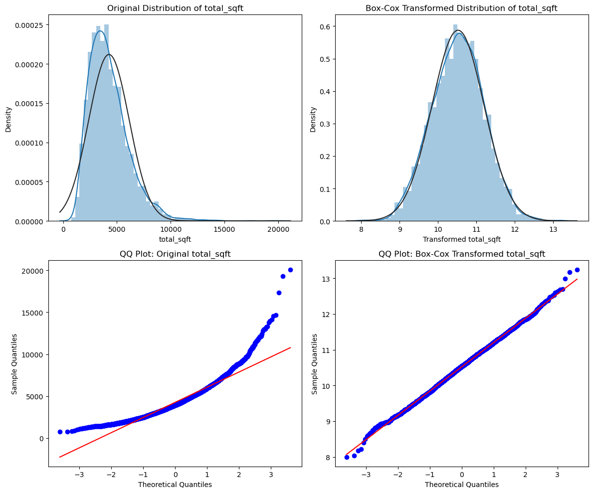

## Box-Cox Transformation

This section transforms selected variables using the Box-Cox method, enhancing their normality. The lambda values are retained for reversion.

<details>
```python
columns_to_transform = ['price', 'sqft_lot', 'sqft_above', 'total_sqft']

lambda_values = {}

for column in columns_to_transform:
    transformed_data, lambda_value = boxcox(df[column])
    df[column] = transformed_data
    lambda_values[column] = lambda_value

for column, lambda_value in lambda_values.items():
    print(f"Lambda value for {column}: {lambda_value}")

df.head()
```
</details>

| Variable      | Lambda Value          |
|---------------|-----------------------|
| Price         | -0.1586               |
| Sqft Lot      | -0.1812               |
| Sqft Above    | -0.2155               |
| Total Sqft    | 0.0560                |


